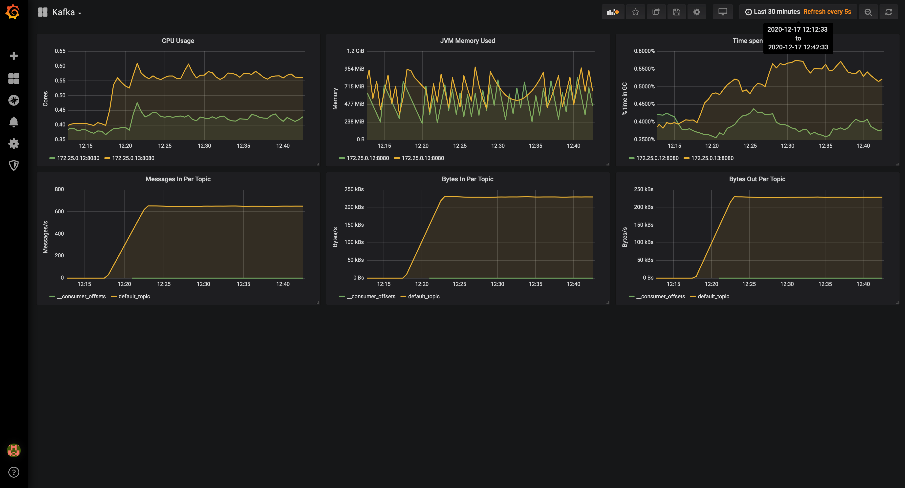
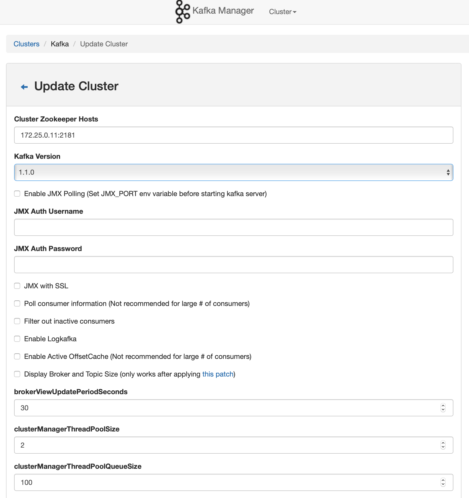
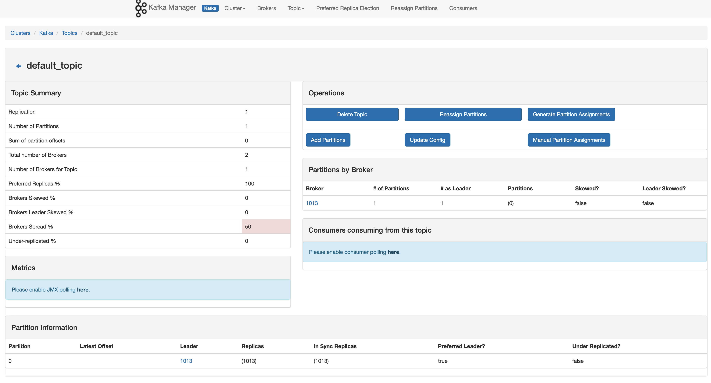
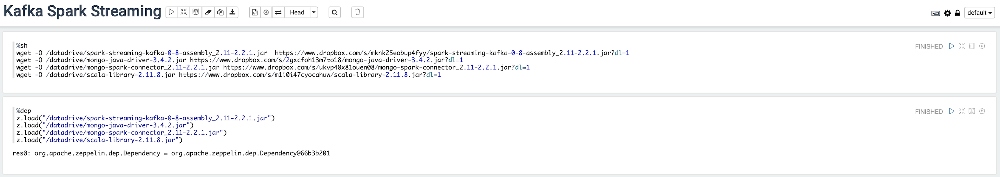
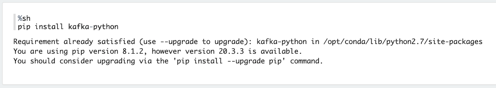
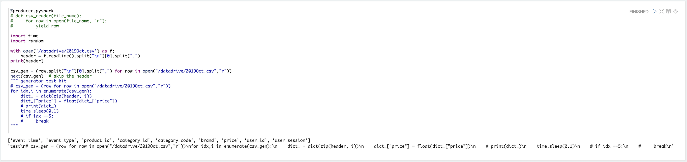
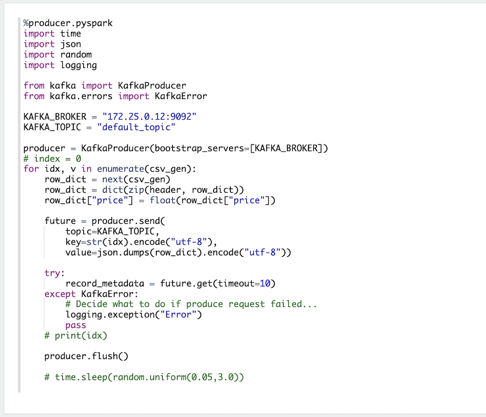
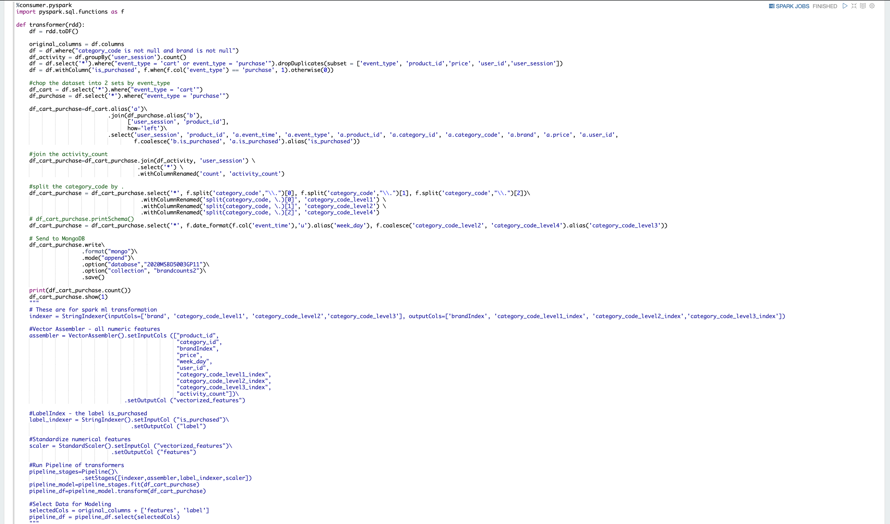
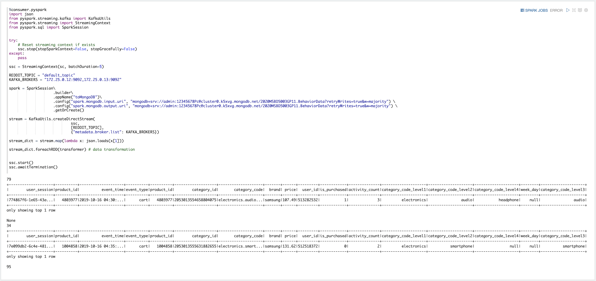

# One Click Deploy: Kafka Spark Streaming with Zeppelin UI

This repository contains a docker-compose stack with Kafka and Spark Streaming, together with monitoring with Kafka Manager and a Grafana Dashboard. The networking is set up so Kafka brokers can be accessed from the host.

It also comes with a producer-consumer example using a small subset of the [US Census adult income prediction dataset](https://www.kaggle.com/johnolafenwa/us-census-data).

## High level features:

<table>
<tr>
<td style="width: 50%">
<h2>Monitoring with grafana</h2>

</td>
<td>
<h2>Zeppelin UI</h2>

</td>
</tr>
<td style="width: 50%">
<h2>Kafka Manager (add cluster monitor)</h2>

</td>
<td style="width: 50%">
<h2>Kafka Manager (topics review)</h2>

</td>
</table>

## Access(Port) Summary

| Container | Image | Tag | Accessible | UI Portal |
|:-:|:-:|:-:|:-:|:-:|
| Zeppelin<br/>(Spark Notebook) | apache/zeppelin | 0.8.1 | 172.25.0.19:8080 | [localhost:20085](localhost:20085) |
| Zookeeper | wurstmeister/zookeeper | latest | 172.25.0.11:2181 | / |
| Kafka1 | wurstmeister/kafka | 2.12-2.2.0 | 172.25.0.12:9092 | / |
| Kafka2 | wurstmeister/kafka | 2.12-2.2.0 | 172.25.0.13:9092 | / |
| Kafka Manager | hlebalbau/kafka_manager | 1.3.3.18 | 172.25.0.14:9000 | [localhost:20086](localhost:20086) |
| Prometheus | prom/prometheus | v2.8.1 | 172.25.0.15:9090 | / |
| Grafana | grafana/grafana | 6.1.1 | 172.25.0.16:3000 | [localhost:20087](localhost:20087) |

---

<br/>
<br/>

# Quickstart

### 1. Run the service in background
```bash
# Clone repo
git clone https://github.com/2020MSBD5003GP11/SparkEngine.git
cd SparkEngine

# Run service in background
docker-compose up -d
```
<br/>

### 2. Access the notebook

[Zeppelin Notebook](localhost:20085) provide a notebook entrypoint for easily accsesing spark interpreter.

Now we can start running the cells. 

<br/>

### 2.1) Setup
#### Load Java Library for Kafka , MongoDB connector


#### Install python-kafka dependency


<br/>

### 2.2) Producer
`%producer.pyspark` is an interpreter that we'll be able to run multiple kernel in parallel.

#### Dataset Generator


#### Produce Main script to flush data


<br/>

### 2.3) Consumer
`%consumer.pyspark` is another interpreter to run our pyspark job in parallel to the producer.

#### transformer


#### Connect to the stream


<br/>

### 2.4) Monitor Kafka

#### Setup Kafka Manager

Access [http://localhost:20086/addCluster](http://localhost:20086/addCluster) to set up Kafka Manager<br/> Fill up the following two fields:

| Cluster name | Zookeeper hosts |
|:-:|:-:|
|`Kafka` |`172.25.0.11:2181` |

<br/>


---

#### Access the topic information

You can view the topics in [http://localhost:20086/clusters/Kafka/topics/default_topic](http://localhost:20086/clusters/Kafka/topics/default_topic)


---

#### Metrics Visualization in Grafana Dashboard

Finally, you can access dashboard in Grafana by going to 
[http://localhost:20087/d/xyAGlzgWz/kafka?orgId=1](http://localhost:20087/d/xyAGlzgWz/kafka?orgId=1)

Access info:
| Usename | password |
|:-:|:-:|
| `admin` | `password`|

<br/>


